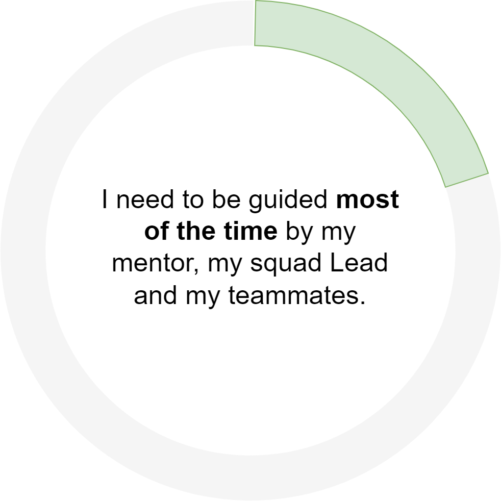

|                  Extent of influence                    |                        Autonomy                         | Area of Ownership                                       |
| :----------------------------------------------------------: | :----------------------------------------------------------: | ------------------------------------------------------------ |
|  |  |  |
|         **Business impact and organizational reach**         |    **What level of autonomy is expected for that level**     | **Technical or organizational levers the individual can exercise there ownership to achieve business impact** |
|   I work within the scope of my squad and my own professional progression. |  | **Craft** Learning and Improving **Technical Strategy** I learn about my team’s technical strategy and get familiar with the tools and the vision **Project Leadership** Learning to lead myself in my tasks **Innovation** I bring ideas that I have to more seniors members of the team and I am leveraging my craft to unleash them (ex. Friday afternoons) **Mentoring** I help as best as I can **Product/Domain expertise** I explore and I’m curious |

## 🏆Results

| **Responsibility**  | **Key Behaviours**                                                                                                                                                                                                                                      |
| :------------------- |:--------------------------------------------------------------------------------------------------------------------------------------------------------------------------------------------------------------------------------------------------------|
| **Impact**| {::nomarkdown}<ul><li>I work with my mentor to prioritize tasks that add the most value for my progression while delivering results for my product</li></ul>{:/}                                                                                        |
| **Ownership**| {::nomarkdown}<ul><li>I follow through on my Internship project, learn to take responsibility for my work, and deliver my project on time <li>I ask questions to clarify expectations <li>I own my failures and learn from them</li></ul>{:/} |
| **Decision Making**| {::nomarkdown}<ul><li> I escalate to my Lead when I get stuck and reflect on ways that I can improve from my mistakes </li></ul>{:/}                                                                                                                    |

## 🌟Direction

| **Responsibility**       | **Key Behaviours** |
| :----------------------- |:-------------------|
| **Agility / Innovation** | {::nomarkdown}<ul><li>TODO </li></ul>{:/}                 |

## 🌳Talent

| **Responsibility**  | **Key Behaviours**                                                                                                                                      |
| :------------------ |:--------------------------------------------------------------------------------------------------------------------------------------------------------|
| **Personal growth** | {::nomarkdown}<ul><li> I learn from my Squad Lead and peers, and from the feedback I get on my code. I work towards excellence in my work</li></ul>{:/} |

## 🤼Culture

| **Responsibility** | **Key Behaviours**                                                                                                                                                                                                                                                                                       |
| :----------------- |:---------------------------------------------------------------------------------------------------------------------------------------------------------------------------------------------------------------------------------------------------------------------------------------------------------|
| **Collaboration**  | {::nomarkdown}<ul><li>I am learning to effectively collaborate to get work done</ul>{:/}                                                                                                                                                                                                                 |
| **Communication**  | {::nomarkdown}<ul><li>I write and speak clearly <li>I listen to understand others and ask clarifying questions <li>To better formulate and illustrate questions, I make an effort to understand challenging tasks on my own before asking for support from my Tech Lead or peers</li></ul>{:/} |

## ⌨️Craft

*My primary craft focus is on learning the fundamentals of reading and writing code within a large, long-lived codebase, gaining familiarity with the technologies in my area of work, and learning to work against plans and schedules.*

| **Responsibility** | **Key Behaviours** |
| :----------------- |--------------------|
| **Code Fluency**   | {::nomarkdown}<ul><li>I translate ideas into clear code, written to be read as well as executed <li>I'm capable of reading and navigating functions and classes/modules that I didn't write <li>I test my code and changes thoroughly</li></ul>{:/}                |
