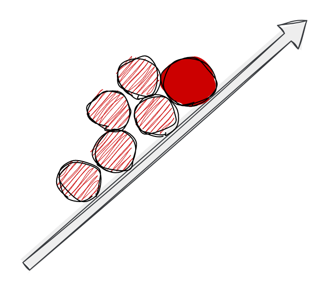

|                  Extent of influence                    |                        Autonomy                         | Area of Ownership                                       |
| :----------------------------------------------------------: | :----------------------------------------------------------: | ------------------------------------------------------------ |
|  |  |  |
|         **Business impact and organizational reach**         |    **What level of autonomy is expected for that level**     | **Technical or organizational levers the individual can exercise there ownership to achieve business impact** |
|   I work within the scope of my squad and my own professional progression. | ⭐ I need to be guided **most of the time** by my squad Lead and my teammates on well-defined tasks. | **Craft** Learning and Improving **Technical Strategy** I learn about my team’s technical strategy and get familiar with the tools and the vision **Project Leadership** I'm participating in my teams's project and I contribute when I feel comfortable **Innovation** I bring ideas that I have to more seniors members of the team and I am leveraging my craft to unleash them (ex. Friday afternoons) **Mentoring** I sometimes unblock teammates and help as best as I can **Product/Domain expertise** I explore and I’m curious |
|                                                              |                                                              |                                                              |

## 🏆Results

| **Responsibility**  | **Key Behaviours**                                                                                                                                                                                                                                                                                 |
| :------------------- |:---------------------------------------------------------------------------------------------------------------------------------------------------------------------------------------------------------------------------------------------------------------------------------------------------|
| **Impact**| {::nomarkdown}<ul><li>I work with my Tech Lead to prioritize tasks that add the most value and deliver high-quality results for my product <li>I understand and effectively participate in the core agile processes and ceremonies of my squad.</li></ul>{:/} |
| **Ownership**       | {::nomarkdown}<ul><li>I follow through on my commitments, take responsibility for my work, and deliver my work on time  <li> I ask questions to clarify expectations I own my failures and learn from them</li></ul>{:/} |
| **Decision Making**| {::nomarkdown}<ul><li> I escalate to my Lead when I get stuck and reflect on ways that I can improve from my mistakes </li></ul>{:/}                                                                                                                                                          |

## 🌟Direction

| **Responsibility**       | **Key Behaviours**                                           |
| :----------------------- | :----------------------------------------------------------- |
| **Agility / Innovation** | {::nomarkdown}<ul><li>I'm open to and act upon feedback from my manager and peers <li>I'm gaining self-awareness about my strengths and areas for development <li>I have a high standard of excellence for my work</li></ul>{:/} |

## 🌳Talent

| **Responsibility**  | **Key Behaviours**                                                                                                                                                                                                                                                                                                              |
| :------------------ |:--------------------------------------------------------------------------------------------------------------------------------------------------------------------------------------------------------------------------------------------------------------------------------------------------------------------------------|
| **Personal growth** | {::nomarkdown}<ul><li>I share new ideas and can adapt my work when circumstances change</li></ul>{:/}                                                                                                                                                                                                                           |
| **Hiring**          | {::nomarkdown}<ul><li>I am learning to interview and assess candidates to help us build a diverse and talented team. I consistently provide timely, detailed, and evidence-based interview feedback <li>I am able to represent my team’s initiatives and goals to candidates in a compelling way</li></ul>{:/}     |

## 🌳Culture

| **Responsibility**        | **Key Behaviours**                                                                                                                                                                                                                                                      |
| :------------------------ |:------------------------------------------------------------------------------------------------------------------------------------------------------------------------------------------------------------------------------------------------------------------------|
| **Collaboration**         | {::nomarkdown}<ul><li>I can effectively collaborate to get work done <li>I work with my manager to manage conflict with empathy in mind  </li></ul>{:/}                                                                                                                                   |
| **Organizational health** | {::nomarkdown}<ul><li>I listen to different perspectives and I remove biases from my words and actions <li>I practice the LRDS Diversity Commitments on a regular basis   </li></ul>{:/}                                                                                                                    |
| **Communication**         | {::nomarkdown}<ul><li>I write and speak clearly <li>I listen to understand others and ask clarifying questions <li>I share relevant information on my project including difficult task-level trade-offs that impact the product to my manager and team (including product/business partners). </li></ul>{:/}    |

## ⌨️Craft

*My primary craft focus is on learning the fundamentals of reading and writing code within a large, long-lived codebase, gaining familiarity with the technologies in my area of work, and learning to work against plans and schedules.*

| **Responsibility** | **Key Behaviours**                                           |
| :----------------- | ------------------------------------------------------------ |
| **Code Fluency**   | {::nomarkdown}<ul><li>I translate ideas into clear code, written to be read as well as executed <li>My code is free of glaring errors - bugs are in edge cases or design, not mainline paths - and is well documented and well tested with appropriate use of manual vs automated tests <li>I’m capable of reading and navigating functions and classes/modules that I didn’t write <li>I am learning to tackle coding tasks with high throughput while maintaining appropriately high quality; I optimize for either speed or quality, depending on the explicitly stated needs of my team </li></ul>{:/}    |
