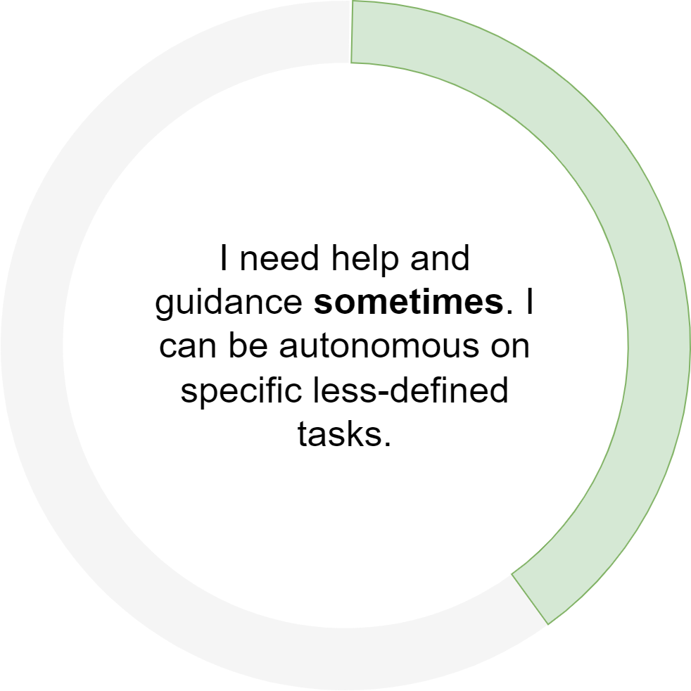

|                  Extent of influence                    |                        Autonomy                         | Area of Ownership                                       |
| :----------------------------------------------------------: | :----------------------------------------------------------: | ------------------------------------------------------------ |
|  |  |  |
|         **Business impact and organizational reach**         |    **What level of autonomy is expected for that level**     | **Technical or organizational levers the individual can exercise there ownership to achieve business impact** |
|   I work within the scope of my squad and I’m involved to help and contribute to my close teammates success. |  | **Craft** Stabilizing **Technical Strategy** I learn about my team's technical strategy and get familiar with the tools and vision **Project Leadership** I give my opinion. I can lead tasks relative to my sphere of influence. I'm proactively digging deeper than what has been asked **Innovation** I bring ideas that I have to more seniors members of the team and I am leveraging my craft to unleash them (ex. Friday afternoons) **Mentoring** I sometimes unblock teammates and help as best as I can **Product/Domain expertise** I explore and I’m curious |

## 🏆Results

| **Responsibility**  | **Key Behaviours**                                                                                                                                                                                                                                                                                                                                                                                                                |
| :------------------- |:----------------------------------------------------------------------------------------------------------------------------------------------------------------------------------------------------------------------------------------------------------------------------------------------------------------------------------------------------------------------------------------------------------------------------------|
| **Impact**| {::nomarkdown}<ul><li>I act with urgency and deliver high-quality work that will add the most value.  <li>I work with my Tech Lead to direct my focus so my work advances my team's goals <li>I prioritize the right things and don't overcomplicate my work. When necessary, I propose appropriate scope adjustments. <li>I effectively participate in the core Agile processes of my squad, including recommending and implementing process improvements.</li></ul>{:/} |
| **Ownership**| {::nomarkdown}<ul><li>I follow through on my commitments, take responsibility for my work, and deliver on time. <li> I proactively identify and advocate for opportunities to improve the current state of projects <li>I own my failures and learn from them. <li>I think a step or two ahead in my work, solve the right problems before they become bigger problems, and problem-solve with my Lead when I'm stuck.</li></ul>{:/} |
| **Decision Making**| {::nomarkdown}<ul><li>I Identify and gather input from others and consider customer needs to make informed and timely decisions.</li></ul>{:/}                                                                                                                                                                                                                                                                                    |

## 🌟Direction

| **Responsibility** | **Key Behaviours**                                                                                                                    |
|:-------------------|:--------------------------------------------------------------------------------------------------------------------------------------|
| **Agility**        | {::nomarkdown}<ul><li>I’m open to change and enthusiastic about new initiatives.  <li>I work with my manager to navigate complex and ambiguous situations.</li></ul>{:/} |
| **Innovation**     | {::nomarkdown}<ul><li>I ask questions and contribute to new ideas/approaches.  <li>I experiment with new approaches and share what I learned.</li></ul>{:/}    |

## 🌳Talent

| **Responsibility**     | **Key Behaviours**                                           |
| :--------------------- | :----------------------------------------------------------- |
| **Personal growth**    | {::nomarkdown}<ul><li>I proactively ask for feedback from those I work with and identify ways to act upon it.  <li> I have self-awareness about my strengths and areas for development.  <li> I drive discussions with my Squad Lead about aspirational goals and seek out opportunities to learn and grow</li></ul>{:/} |
| **Hiring**             | {::nomarkdown}<ul><li>I am learning to interview and assess candidates to help us build a diverse and talented team.  <li>I consistently provide timely, detailed, and evidence-based interview feedback</li></ul>{:/} |
| **Talent Development** | {::nomarkdown}<ul><li>I model integrity and a high standard of excellence for my work.  <li> I help the more junior members of my Squad</ul>{:/} |

## 🤼Culture

| **Responsibility**        | **Key Behaviours**                                           |
| :------------------------ | :----------------------------------------------------------- |
| **Collaboration**         | {::nomarkdown}<ul><li>I am skilled at collaborating with others to get work done <li>I work with my manager to manage conflict with empathy and cooperation in mind</li></ul>{:/} |
| **Organizational health** | {::nomarkdown}<ul><li>I contribute to a positive sense of community on the team (e.g. engage in Tech Friday, team lunches, team gatherings, and other group activities, help with new-hire on-boarding).  <li>I listen to different perspectives and I cut biases from my words and actions.  </ul>{:/} |
| **Communication**         | {::nomarkdown}<ul><li>I write and speak clearly <li>I listen to understand others and ask clarifying questions <li>I share relevant information on my projects to my tech lead, team and customers</li></ul>{:/} |

## ⌨️Craft

*My primary craft focus is consistently delivering high-quality code. I am beginning to develop skills in designing software components and translating product or business requirements into simple projects.*

| **Responsibility**      | **Key Behaviours**                                                                                                                                                                                                                                                                                                                                                                                                                                                                                     |
|:------------------------|--------------------------------------------------------------------------------------------------------------------------------------------------------------------------------------------------------------------------------------------------------------------------------------------------------------------------------------------------------------------------------------------------------------------------------------------------------------------------------------------------------|
| **Code Fluency**        | {::nomarkdown}<ul><li>I translate ideas into clear code, written to be read as well as executed.  <li> My code is free of glaring errors - bugs are in edge cases or design, not mainline paths - and is well documented and well tested with appropriate use of manual vs automated tests  <li> I’m able to read and navigate through a large code base and effectively debug others’ code  <li> I address code tasks with both high throughput and appropriately high quality for the stage of project I am working on</li></ul>{:/} |
| **Software design**     | {::nomarkdown}<ul><li>I’m able to understand the existing designs and technology choices within my area, and I make appropriate adjustments to existing designs when necessary.  <li> Code modules I write exhibit good separation of concerns</li></ul>{:/}                                                                                                                                                                                                                                                                            |
| **Architecture design** | {::nomarkdown}<ul><li>I’m able to decompose a simple problem or business scenario into a solution composed of multiple software components interacting with each other</li></ul>{:/}                                                                                                                                                                                                                                                                                                                                                    |
