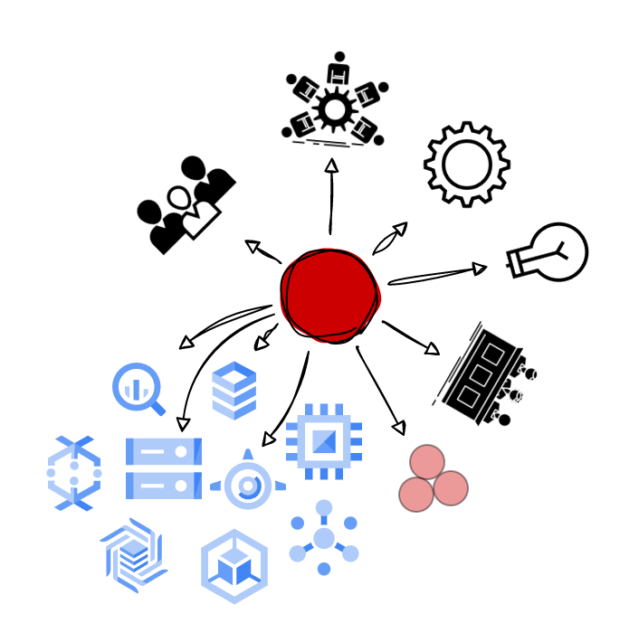

|                  Extent of influence                    |                        Autonomy                         | Area of Ownership                                       |
| :----------------------------------------------------------: | :----------------------------------------------------------: | ------------------------------------------------------------ |
|  |  |  |
|         **Business impact and organizational reach**         |    **What level of autonomy is expected for that level**     | **Technical or organizational levers the individual can exercise there ownership to achieve business impact** |
|  I help design the high-level objectives of my squad. I’m involved in high-level decisions and discussions of a particular tech domain or tech layer. |  | **Craft** Extending / Specializing **Technical Strategy** I participate in some technical strategy discussions for my Squad **Project Leadership** I define and deliver well-scoped milestones for a project. I may de a technical lead for projects on my team **Innovation** I‘m pushing innovative ideas and projects for my product and my team’s processes **Mentoring** I am sometimes the official mentor for newcomers; I plan and I follow their progression. **Product/Domain expertise** Expert of some parts of my product / technical domain. |

## 🏆Results

| **Responsibility**  | **Key Behaviours**                                                                                                                                                                                                                                                                                                                                                                                                                |
| :------------------- |:----------------------------------------------------------------------------------------------------------------------------------------------------------------------------------------------------------------------------------------------------------------------------------------------------------------------------------------------------------------------------------------------------------------------------------|
| **Impact**| {::nomarkdown}<ul><li>I deliver many of my Squad’s goals on time and with a high standard of quality <li>My understanding of the business context and my Squad’s goals enable me to have the greatest customer impact and allows me to make independent technical decisions in the face of open-ended requirements <li>I can identify when my results aren’t moving the needle for our business/squad goals or serving the needs of customers in a meaningful way and work with Tech Lead to redirect my focus <li>I get work to a simple place by focusing on the heart of the problem and prioritizing the right things</li></ul>{:/} |
| **Ownership**| {::nomarkdown}<ul><li>I proactively identify new opportunities and advocate for and implement improvements to the current state of projects — potentially having broader business impact across teams or products <li>I take responsibility for any failures on my project and take action to prevent them in the future. I embrace and share the learnings from those failures <li>When I encounter barriers, I unblock myself and my team by proactively assessing and eliminating the root cause</li></ul>{:/} |
| **Decision Making**| {::nomarkdown}<ul><li>I make informed decisions by consulting the right stakeholders and balancing details with the big picture <li>I understand the implications of my decisions and adjust my approach based on the impact and risk (e.g. choosing a more iterative approach based on the degree of uncertainty with respect to product fit, while maintaining a view of the long term arc needed to accomplish business goals). <li>I make timely decisions but don’t cut corners that would compromise my customer’s trust</li></ul>{:/} |

## 🌟Direction

| **Responsibility** | **Key Behaviours**                                           |
| :----------------- | :----------------------------------------------------------- |
| **Agility**        | {::nomarkdown}<ul><li>I embrace change and adapt quickly to it <li>I’m able to navigate ambiguity and remain resilient through ups and downs</li></ul>{:/} |
| **Innovation**     | {::nomarkdown}<ul><li>I am beginning to push boundaries to generate and implement ideas that aim to drive our products and tools forward <li>I set audacious goals, take risks, and share lessons learned</li></ul>{:/} |
| **Strategy**       | {::nomarkdown}<ul><li>I define the technical roadmap for complex projects, refining it as the projects progress, and provide leadership for the people executing on the project <li>I help my Squad Lead or PM defining my squad's priorities and secure buy-in. <li>I generate excitement for my/the Squad's strategy</li></ul>{:/} |

## 🌳Talent

| **Responsibility**     | **Key Behaviours**                                           |
| :--------------------- | :----------------------------------------------------------- |
| **Personal growth**    | {::nomarkdown}<ul><li>I proactively ask for feedback from those I work with and identify ways to act upon it <li>I have self-awareness about my strengths and areas for development <li>I drive discussions with my Squad Lead about aspirational goals and seek out opportunities to learn and grow</li></ul>{:/} |
| **Hiring**             | {::nomarkdown}<ul><li>I contribute to interviewing and assessing candidates to help us build a diverse and talented team. I am calibrated and consistently perform high-signal interviews. <li>I gain the trust of candidates and can represent LRDS's mission, strategy, and culture throughout the interview process <li>I am able to represent my team’s technical challenges to potential candidates in a compelling way (e.g. 1:1 chats, blog posts, public speaking)</li></ul>{:/} |
| **Talent Development** | {::nomarkdown}<ul><li>I model integrity and a high standard of excellence for my work. I leverage this to set and hold the bar for quality and best practices for my Squad (e.g. via code reviews) <li>I identify and support areas of growth for my teammates that take into account their skills, backgrounds and working styles <li>I solicit and offer honest and constructive feedback that is delivered with empathy to help others learn and grow</li></ul>{:/} |

## 🤼Culture

| **Responsibility**        | **Key Behaviours**                                           |
| :------------------------ | :----------------------------------------------------------- |
| **Collaboration**         | {::nomarkdown}<ul><li>I build relationships and drive coordination across teams & disciplines, helping get to positive outcomes <li>I avoid blame and solve the right problems, disagreeing and committing when necessary</li></ul>{:/} |
| **Organizational health** | {::nomarkdown}<ul><li>Working with my manager, I leverage the strengths & skills of the members of my team, and help identify talent gaps required for team success <li>I act as a partner to my manager in setting the cultural tone for the team. I support an environment where all employees are included and heard <li>I motivate others to bring their authentic selves every day and contribute to building community at LRDS</li></ul>{:/} |
| **Communication**         | {::nomarkdown}<ul><li>I tailor my message to my audience, presenting it clearly and concisely <li>I proactively share information so the right people are informed and aligned</li></ul>{:/} |

## ⌨️Craft

I play a role in ensuring the quality of my team’s technical work, both code and software designs. I am responsible for designing the software or systems required in my area of ownership and ensuring that they meet their design objectives. My understanding of business context and purpose enables me to make technical decisions aligned with longer term needs, not just immediate requirements.

| **Responsibility**      | **Key Behaviours**                                           |
| :---------------------- | ------------------------------------------------------------ |
| **Code Fluency**        | {::nomarkdown}<ul><li>The expectations for code fluency do not go up beyond *Senior level (SW3)* (though some specialist engineers may go deep in this area)</li></ul>{:/} |
| **Software design**     | {::nomarkdown}<ul><li>I am able to give quality feedback on designs written by other members of my team, asking probing, insightful questions that solidify choices and surface erroneous assumptions <li>I effectively and quickly debug cross-module issues, and may intuit where bugs might lie due to my deep knowledge of the libraries, platforms, and systems that my software relies on</li></ul>{:/} |
| **Architecture design** | {::nomarkdown}<ul><li>I’m able to create coherent designs with multiple components interacting across API or system boundaries; bugs do not creep in at the boundaries between components due to mismatches in expectations of what is technically feasible <li>I’m capable of rolling out a component or major feature (and deprecating an existing system or feature) reliably - including appropriate monitoring, paging, etc are in place, and that failure domains are understood and characterized appropriately before large scale rollout. For early stage products, I am able to roll out with an eye toward achieving learning goals untainted by poor quality. <li>I design clear success metrics and achieve those metrics consistently post-launch through the lifetime of the system or feature. For early stage products, those success metrics may be oriented around learning goals rather than usage goals, given the inherent unpredictability of achieving product/market fit.</li></ul>{:/} |
