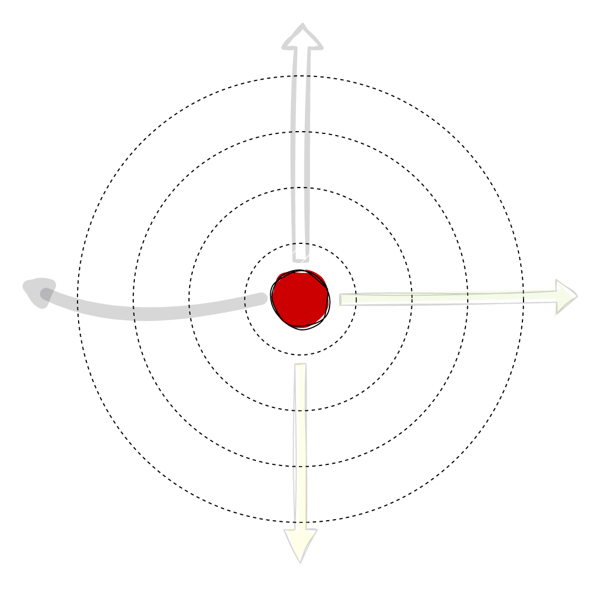
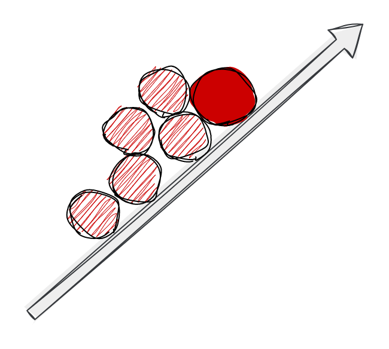
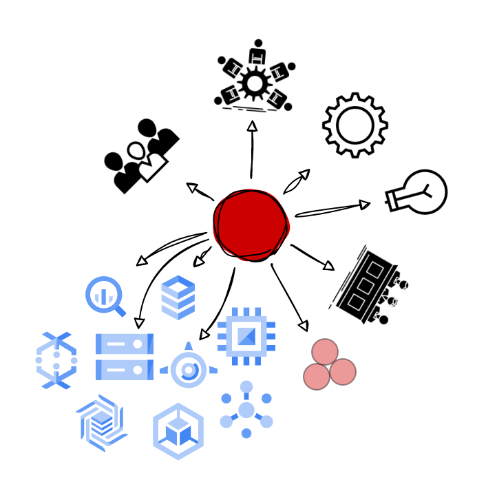

|                  Extent of influence                    |                        Autonomy                         | Area of Ownership                                       |
| :----------------------------------------------------------: | :----------------------------------------------------------: | ------------------------------------------------------------ |
|  |  |  |
|         **Business impact and organizational reach**         |    **What level of autonomy is expected for that level**     | **Technical or organizational levers the individual can exercise there ownership to achieve business impact** |
|  I’m involved and influence company objectives with connections and links with other departments and Execs. I’m part of discussions with external companies and partners.  | ⭐⭐⭐⭐⭐ I’m autonomous on **every situations**. I sometimes need help and guidance to align with business objectives and company strategy | **Craft** Transferring / Sharing and increasing breadth of knowledge **Technical Strategy** I'm participating in the long-term business's technical strategy with others **Project Leadership** I autonomously define and deliver technical roadmaps of larger company/M&A projects **Innovation** I partner with cross-functional stakeholders to identify major new business opportunities unlocked by technical capabilities **Mentoring** I am sometimes the official mentor for newcomers and I plan and follow their progression **Product/Domain expertise** My high-level technical expertise helps me be part of business needs and prioritization discussions with stakeholders |

## 🏆Results

| **Responsibility**  | **Key Behaviours**                                                                                                                                                                                                                                                                                                                                                                                                                                                                                                                                                                                                                                                                                                                                                                                                                                                                                                                                                                                         |
| :------------------- |:-----------------------------------------------------------------------------------------------------------------------------------------------------------------------------------------------------------------------------------------------------------------------------------------------------------------------------------------------------------------------------------------------------------------------------------------------------------------------------------------------------------------------------------------------------------------------------------------------------------------------------------------------------------------------------------------------------------------------------------------------------------------------------------------------------------------------------------------------------------------------------------------------------------------------------------------------------------------------------------------------------------|
| **Impact**| {::nomarkdown}<ul><li>I identify and execute on significant engineering/company-wide opportunities by understanding how technical capabilities meet customer needs. I proactively work with business owners to help them understand these new capabilities and work with them to build the right roadmap for the business  <li> I execute large projects to a very high standard — e.g. against a tight deadline with significant consequences of failure, or in a manner that allows rapid learning to clarify significant ambiguity, or to a standard of quality well exceeding that of the current system (though not all simultaneously)  <li> I proactively identify and help to refocus my team's efforts when projects are off-course or not technically feasible and results aren’t moving the needle for our business/team goals or serving the needs of customers in a meaningful way  <li> I know which levers to pull to drive meaningful results and understand the wider, cross-functional implications of my work</li></ul>{:/} |
| **Ownership**| {::nomarkdown}<ul><li>I have a sense of responsibility and obligation to act on opportunities I see across the engineering org/company  <li> I transcend organizational boundaries by taking a holistic view of the company’s goals and taking responsibility across the company, not just within my immediate scope of ownership</li></ul>{:/}                                                                                                                                                                                                                                                                                                                                                                                                                                                                                                                                                                                                                                                 |
| **Decision Making**| {::nomarkdown}<ul><li>I act thoughtfully and decisively in critical situations even when making challenging or unpopular decisions  <li> I'm able to reach the right decision despite conflicting perspectives</li></ul>{:/}                                                                                                                                                                                                                                                                                                                                                                                                                                                                                                                                                                                                                                                                                                                                                                                                                                           |

## 🌟Direction

| **Responsibility** | **Key Behaviours**                                                                                                                                                                                                                                                                                                                                                                                                                                                                                                               |
| :----------------- |:---------------------------------------------------------------------------------------------------------------------------------------------------------------------------------------------------------------------------------------------------------------------------------------------------------------------------------------------------------------------------------------------------------------------------------------------------------------------------------------------------------------------------------|
| **Agility**        | {::nomarkdown}<ul><li>When necessary, I am able to introduce change into the organization, help others understand the business case for change, and create excitement to drive adoption of the change </li></ul>{:/}                                                                                                                                                                                                                                                                                                             |
| **Innovation**     | {::nomarkdown}<ul><li>I push boundaries to generate and implement breakthrough ideas that aim to drive our products and tools forward   <li>I demonstrate creativity, e.g. by finding simple, generalizable solutions that open up or unblock new technical or business opportunities in unexpected ways  <li> I create an environment supporting experimentation and iteration</li></ul>{:/}                                                                                                                                                  |
| **Strategy**       | {::nomarkdown}<ul><li>I partner with Directors and other members of senior EPD leadership to define a long-term vision for my team or org that factors in both a deep understanding of what is happening in the business and in the market as well as the technical limitations and possibilities of LRDS's software and systems.   <li>I anticipate challenges and am able to influence the technical direction of the team or org to execute on that vision even in the face of potential significant misalignment </li></ul>{:/}            |

## 🌳Talent

| **Responsibility**     | **Key Behaviours**                                                                                                                                                                                                                                                                                                                                                                                                                                                                                                                                                                                                                                     |
| :--------------------- |:-------------------------------------------------------------------------------------------------------------------------------------------------------------------------------------------------------------------------------------------------------------------------------------------------------------------------------------------------------------------------------------------------------------------------------------------------------------------------------------------------------------------------------------------------------------------------------------------------------------------------------------------------------|
| **Personal growth**    | {::nomarkdown}<ul><li>I proactively ask for feedback from those I work with and identify ways to act upon it  <li> I have self-awareness about my strengths and areas for development  <li> I drive discussions with my manager about aspirational goals and seek out opportunities to learn and grow </li></ul>{:/}                                                                                                                                                                                                                                                                                                                                                                       |
| **Hiring**             | {::nomarkdown}<ul><li>I am an active participant in the hiring process for senior candidates (for example, by participating in hiring committee, debriefs etc)  <li> I attract talent for a variety of roles with diversity in mind  <li> I gain the trust of candidates and can represent LRDS's mission, strategy, and culture throughout the interview process.  <li> I am an effective partner to my manager and  am able to represent my team’s technical challenges to candidates in an exciting way (e.g. 1:1 selling, blog posts, public speaking)  </li></ul>{:/}                                                                                                                 |
| **Talent Development** | {::nomarkdown}<ul><li>I model a standard of excellence that supports a culture of high performance on my team. I drive EPD-wide processes and define the bar for engineering-wide quality and best practices  <li> I invest time to coach and mentor my teammates (particularly ones looking to grow into L6/L7). I take into account their skills, backgrounds, working styles and solicit and provide thoughtful, constructive feedback to them.  <li> I devote time to spreading my knowledge widely via talks, blog posts or written documentation.  <li> I participate in calibration sessions by providing meaningful feedback to ensure fair and consistent decisions</li></ul>{:/} |

## 🌳Culture

| **Responsibility**        | **Key Behaviours**                                                                                                                                                                                                                                                                                                                                                                                                                                                                                                                                                                                                                                                          |
| :------------------------ |:----------------------------------------------------------------------------------------------------------------------------------------------------------------------------------------------------------------------------------------------------------------------------------------------------------------------------------------------------------------------------------------------------------------------------------------------------------------------------------------------------------------------------------------------------------------------------------------------------------------------------------------------------------------------------|
| **Collaboration**         | {::nomarkdown}<ul><li>I help break down silos within and across functions and influence others to reach the best outcome for LRDS  <li> I build deep cross-functional relationships, facilitate the right conversations, and settle disagreements by managing different viewpoints   <li>I disagree and commit when necessary to move critical priorities forward </li></ul>{:/}                                                                                                                                                                                                                                                                                                                                |
| **Organizational health** | {::nomarkdown}<ul><li>I act as a partner to managers in setting the cultural tone for the engineering org. I create an inclusive environment for others and ensure diverse perspectives are included   <li>Working with my manager, I leverage the strengths & skills of the members of my team, and help identify talent gaps required for team success  <li> I personify LRDS's culture and values. I champion community building efforts and inclusion initiatives. I work in close partnership with senior leadership to ensure a healthy engineering org.  <li> I lead by example. I am aware of my public presence and actions and my influence on the people around me and LRDS’s culture.</li></ul>{:/} |
| **Communication**         | {::nomarkdown}<ul><li>I develop compelling messages and effectively present them at the executive level  <li> I fine tune my approach to getting buy-in and influencing stakeholders across a variety of audiences </li></ul>{:/}                                                                                                                                                                                                                                                                                                                                                                                                                                                                                                                                                                                    |

## ⌨️Craft

Like Staff Engineers and Principal Engineers, I have a well-rounded set of technical skills and development methodologies, and apply them with a sophisticated approach that is best suited for each project. The primary craft difference between Principal Engineers and Senior Principal Engineers is the scope at which their work applies.

| **Responsibility**      | **Key Behaviours**                                                                                                                                                                                                                                                                                              |
|:------------------------|-----------------------------------------------------------------------------------------------------------------------------------------------------------------------------------------------------------------------------------------------------------------------------------------------------------------|
| **Code fluency**        | {::nomarkdown}<ul><li>The expectations for code fluency do not go up beyond L3 (though some specialist engineers may go deep in this area)  </li></ul>{:/}                                                                                                                                                                                          |
| **Software design**     | {::nomarkdown}<ul><li>The expectations for software design do not go up beyond L5  </li></ul>{:/}                                                                                                                                                                                                                                                   |
| **Architecture design** | {::nomarkdown}<ul><li>The expectations for architecture design do not go up beyond L6 </li></ul>{:/}|
| **Technical strategy**  | {::nomarkdown}<ul><li>The expectations for technical strategy do not currently go up beyond L6 but we expect this to change over time as we have more examples of principal engineers working in this area </li></ul>{:/}                   |
